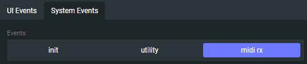
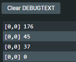

## Overview 

Digital audio workstations, VST plugins and other audio software can send out MIDI. Grid can receive and process these incoming MIDI messages. This article will show an example configuration made with Grid and Ableton.

The MIDI receive functionality can be accessed through the *midi rx* event in the system events tab. The midi rx event is where actions can be configured to react to received MIDI data.

> Actions triggered by system events are unique to each module. To have a control surface where each module reacts to MIDI, you have configure each module's *midi rx* event.

## Basic Setup

Usually the MIDI data sent out by audio software will have the MIDI message in the following format: Command, Parameter 1 (CC or Note), Parameter 2 (CV or Velocity). 

> The command itself contains the channel information. Control Change 178 means that the MIDI command is 176 and channel is 2. 

To enable and see MIDI OUT in action on the DAW's side:

- Enable MIDI OUT for Intech Studio: AC (Grid)
- Map a control element on a Grid controller to a parameter
- You should see a blinking a indicator for sending MIDI OUT

To see results in Grid Editor here are few tips:
- Select the control element MIDI mapped
- Under *system events* choose the *midi rx* event

- Add a *Codeblock* action and call the print function on the variables found in the *Local Variables* action
  `<?lua --[[@cb]] print(ch,cmd,param1,param2)?>` 

  The variables defined in the *Local Variables* action are on the module by default.
- Open the debug panel on the left
- Upon interacting with the control element's mapping, you should see MIDI data.

Great! Now you have a communication between the DAW and Grid, let's see an actual configuration.