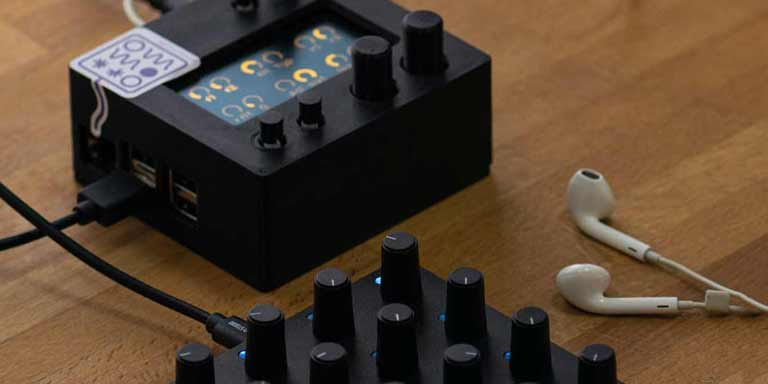
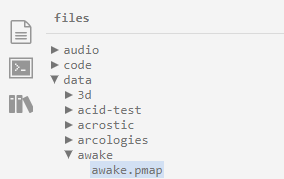
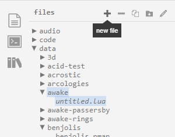
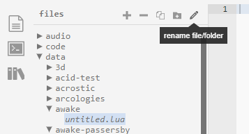
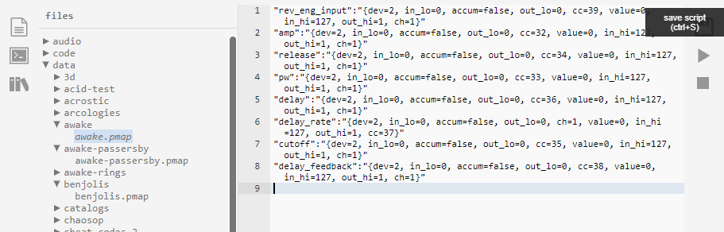

import NornsGrid from './img/norns_po16.jpg'
import ImageLightbox from '@site/src/general-layout-components/ImageLightbox';

import Tabs from '@theme/Tabs';
import TabItem from '@theme/TabItem';

<ImageLightbox imageSrc={NornsGrid} styling={'w-4/5 max-h-60 object-contain'}/>

<!---

--->


For users that would like to just mess around with norns scripts and have a Grid Modular Controller (or any other MIDI controller really), we have created some MIDI maps for popular scripts for easy plug-and-play experience.

### Requirements

- *monome norns (any version)*
- *Intech Studio Grid Modular Controller with the default configuration (optionally multiple modules)*
- *a computer using the same network as norns for access to the norns folders through maiden*

### How to get the .pmap files from your PC to the correct norns destinations?

For users using a **terminal** to access norns, you can just download the chosen .pmap file and upload it to norns in the corresponding script's folder.

For users using **maiden** however, you should follow these steps:

#### Download one of the .pmap files from the selection below that corresponds to a norns script that you have installed on your norns.

<Tabs queryString="current-sctipt">
  <TabItem value="awake" label="awake" default>
    

```lua title="awake.pmap"
"rev_eng_input":"{dev=2, in_lo=0, accum=false, out_lo=0, cc=39, value=0, in_hi=127, out_hi=1, ch=1}"
"amp":"{dev=2, in_lo=0, accum=false, out_lo=0, cc=32, value=0, in_hi=127, out_hi=1, ch=1}"
"release":"{dev=2, in_lo=0, accum=false, out_lo=0, cc=34, value=0, in_hi=127, out_hi=1, ch=1}"
"pw":"{dev=2, in_lo=0, accum=false, out_lo=0, cc=33, value=0, in_hi=127, out_hi=1, ch=1}"
"delay":"{dev=2, in_lo=0, accum=false, out_lo=0, cc=36, value=0, in_hi=127, out_hi=1, ch=1}"
"delay_rate":"{dev=2, in_lo=0, accum=false, out_lo=0, ch=1, value=0, in_hi=127, out_hi=1, cc=37}"
"cutoff":"{dev=2, in_lo=0, accum=false, out_lo=0, cc=35, value=0, in_hi=127, out_hi=1, ch=1}"
"delay_feedback":"{dev=2, in_lo=0, accum=false, out_lo=0, cc=38, value=0, in_hi=127, out_hi=1, ch=1}"
```
<a target="_blank" href="/presets/norns_pmap/awake.pmap" download="awake.pmap"> awake PMAP download link</a> 
</TabItem>
  <TabItem value="benjolis" label="benjolis">
 

```lua title="benjolis.pmap"
"setAmp":"{accum=false, ch=1, out_hi=1, cc=44, out_lo=0, in_lo=0, value=0, in_hi=127, dev=2}"
"setFreq2":"{accum=false, ch=1, out_hi=1, cc=33, out_lo=0, in_lo=0, value=0, in_hi=127, dev=2}"
"setGain":"{accum=false, ch=1, out_hi=1, cc=43, out_lo=0, in_lo=0, value=0, in_hi=127, dev=2}"
"setRungler1":"{accum=false, ch=1, out_hi=1, cc=34, out_lo=0, in_lo=0, value=0, in_hi=127, dev=2}"
"setRungler2":"{accum=false, ch=1, out_hi=1, cc=35, out_lo=0, in_lo=0, value=0, in_hi=127, dev=2}"
"setRunglerFilt":"{accum=false, ch=1, out_hi=1, cc=39, out_lo=0, in_lo=0, value=0, in_hi=127, dev=2}"
"setScale":"{accum=false, ch=1, out_hi=1, cc=41, out_lo=0, in_lo=0, value=0, in_hi=127, dev=2}"
"setFreq1":"{accum=false, ch=1, out_hi=1, cc=32, out_lo=0, in_lo=0, value=0, in_hi=127, dev=2}"
"setLoop":"{accum=false, ch=1, out_hi=1, cc=40, out_lo=0, in_lo=0, value=0, in_hi=127, dev=2}"
"setOutSignal":"{accum=false, ch=1, out_hi=1, cc=42, out_lo=0, in_lo=0, value=0, in_hi=127, dev=2}"
"setFiltFreq":"{accum=false, ch=1, out_hi=1, cc=36, out_lo=0, in_lo=0, value=0, in_hi=127, dev=2}"
"setFilterType":"{accum=false, ch=1, out_hi=1, cc=38, out_lo=0, in_lo=0, value=0, in_hi=127, dev=2}"
"setQ":"{accum=false, ch=1, out_hi=1, cc=37, out_lo=0, in_lo=0, value=0, in_hi=127, dev=2}"
```
   <a target="_blank" href="/presets/norns_pmap/benjolis.pmap" download="benjolis.pmap"> benjolis PMAP download link</a>
  </TabItem>
  <TabItem value="molly_the_poly" label="molly_the_poly">
    

```lua title="molly_the_poly.pmap"
"env_1_release":"{out_lo=0, ch=1, dev=2, in_hi=127, cc=43, in_lo=0, out_hi=1, accum=false, value=0}"
"osc_wave_shape":"{out_lo=1, ch=1, dev=2, in_hi=127, cc=32, in_lo=0, out_hi=3, accum=false, value=0}"
"env_2_release":"{out_lo=0, ch=1, dev=2, in_hi=127, cc=47, in_lo=0, out_hi=1, accum=false, value=0}"
"lp_filter_cutoff":"{out_lo=0, ch=1, dev=2, in_hi=127, cc=36, in_lo=0, out_hi=1, accum=false, value=0}"
"env_1_sustain":"{out_lo=0, ch=1, dev=2, in_hi=127, cc=42, in_lo=0, out_hi=1, accum=false, value=0}"
"pulse_width_mod":"{out_lo=0, ch=1, dev=2, in_hi=127, cc=33, in_lo=0, out_hi=1, accum=false, value=0}"
"lp_filter_mod_env":"{out_lo=0, ch=1, dev=2, in_hi=127, cc=38, in_lo=0, out_hi=1, accum=false, value=0}"
"env_2_sustain":"{out_lo=0, ch=1, dev=2, in_hi=127, cc=46, in_lo=0, out_hi=1, accum=false, value=0}"
"env_2_decay":"{out_lo=0, ch=1, dev=2, in_hi=127, cc=45, in_lo=0, out_hi=1, accum=false, value=0}"
"env_2_attack":"{out_lo=0, ch=1, dev=2, in_hi=127, cc=44, in_lo=0, out_hi=1, accum=false, value=0}"
"lp_filter_resonance":"{out_lo=0, ch=1, dev=2, in_hi=127, cc=37, in_lo=0, out_hi=1, accum=false, value=0}"
"env_1_attack":"{out_lo=0, ch=1, dev=2, in_hi=127, cc=40, in_lo=0, out_hi=1, accum=false, value=0}"
"ring_mod_mix":"{out_lo=0, ch=1, dev=2, in_hi=127, cc=34, in_lo=0, out_hi=1, accum=false, value=0}"
"env_1_decay":"{out_lo=0, ch=1, dev=2, in_hi=127, cc=41, in_lo=0, out_hi=1, accum=false, value=0}"
"chorus_mix":"{out_lo=0, ch=1, dev=2, in_hi=127, cc=35, in_lo=0, out_hi=1, accum=false, value=0}"
```
<a target="_blank" href="/presets/norns_pmap/molly_the_poly.pmap" download="molly_the_poly.pmap"> molly_the_poly PMAP download link</a>
  </TabItem>
  <TabItem value="passersby" label="passersby">
    

```lua title="passersby.pmap"
"drift":"{out_lo=0, ch=1, dev=2, in_hi=127, cc=46, in_lo=0, out_hi=1, accum=false, value=0}"
"fm_low_amount":"{out_lo=0, ch=1, dev=2, in_hi=127, cc=37, out_hi=1, accum=false, in_lo=0, value=0}"
"amp":"{in_lo=0, ch=1, dev=2, in_hi=127, cc=43, out_lo=0, out_hi=1, accum=false, value=0}"
"reverb_mix":"{out_lo=0, ch=1, dev=2, in_hi=127, cc=47, in_lo=0, out_hi=1, accum=false, value=0}"
"glide":"{out_lo=0, ch=1, dev=2, in_hi=127, cc=34, in_lo=0, out_hi=1, accum=false, value=0}"
"lfo_shape":"{out_lo=1, ch=1, dev=2, in_hi=127, cc=44, out_hi=4, accum=false, in_lo=0, value=0}"
"env_type":"{out_lo=1, ch=1, dev=2, in_hi=127, cc=35, out_hi=2, accum=false, in_lo=0, value=0}"
"attack":"{in_lo=0, ch=1, dev=2, in_hi=127, cc=40, out_lo=0, out_hi=1, accum=false, value=0}"
"fm_high_ratio":"{out_lo=0, ch=1, dev=2, in_hi=127, cc=38, in_lo=0, out_hi=1, accum=false, value=0}"
"fm_low_ratio":"{out_lo=0, ch=1, dev=2, in_hi=127, cc=36, in_lo=0, out_hi=1, accum=false, value=0}"
"peak":"{out_lo=0, ch=1, dev=2, in_hi=127, cc=41, out_hi=1, accum=false, in_lo=0, value=0}"
"lfo_freq":"{out_lo=0, ch=1, dev=2, in_hi=127, cc=45, in_lo=0, out_hi=1, accum=false, value=0}"
"fm_high_amount":"{out_lo=0, ch=1, dev=2, in_hi=127, cc=39, in_lo=0, out_hi=1, accum=false, value=0}"
"wave_folds":"{out_lo=0, ch=1, dev=2, in_hi=127, cc=33, out_hi=1, accum=false, in_lo=0, value=0}"
"wave_shape":"{in_lo=0, ch=1, dev=2, in_hi=127, cc=32, out_lo=0, out_hi=1, accum=false, value=0}"
"decay":"{in_lo=0, ch=1, dev=2, in_hi=127, cc=42, out_lo=0, out_hi=1, accum=false, value=0}"
```
<a target="_blank" href="/presets/norns_pmap/passersby.pmap" download="passersby.pmap"> passersby PMAP download link</a>
  </TabItem>
</Tabs>


---


#### Find the place for the .pmap files according to the official monome doc in maiden: https://monome.org/docs/norns/control-clock/#pmaps for the selected script. 



#### Navigate into the script folder and click on the plus sign to create a new file.



#### Remane the file so it becomes "scriptname.pmap".



#### Copy and paste the contents of the downloaded file into the code window and press save in maiden.




#### When the script starts up the plugged in Grid module should be mapped automatically.


:::caution The .pmaps are device ID bound!
So norns assigns a number to a MIDI device, that can be changed at any time by the user. In these example .pmaps we used device 2, but you might have your Grid assigned to a different device ID. Change either the .pmap or the device ID in norns accordingly.
:::

### List of currently available pre-mapped .pmaps
<!---
- [awake](/static/presets/norns_pmap/awake.pmap)
- [benjolis](/static/presets/norns_pmap/benjolis.pmap)
- [molly_the_poly](/static/presets/norns_pmap/molly_the_poly.pmap)
- [passersby](/static/presets/norns_pmap/passersby.pmap)
--->
#### awake

#### benjolis

For benjolis, all of the onscreen parameters have been mapped, but in a different order, to make it a bit more logical.

- oscillator section, first row: freq of osc1, freq of osc2, rungler of osc1, rungler of osc2
- filter section, second row: filter cutoff, filter resonance, filter type (lp/hp), rungler of filter 
- misc section, third row: loop, scale of rungler, selected output 

#### molly_the_poly

#### passersby
