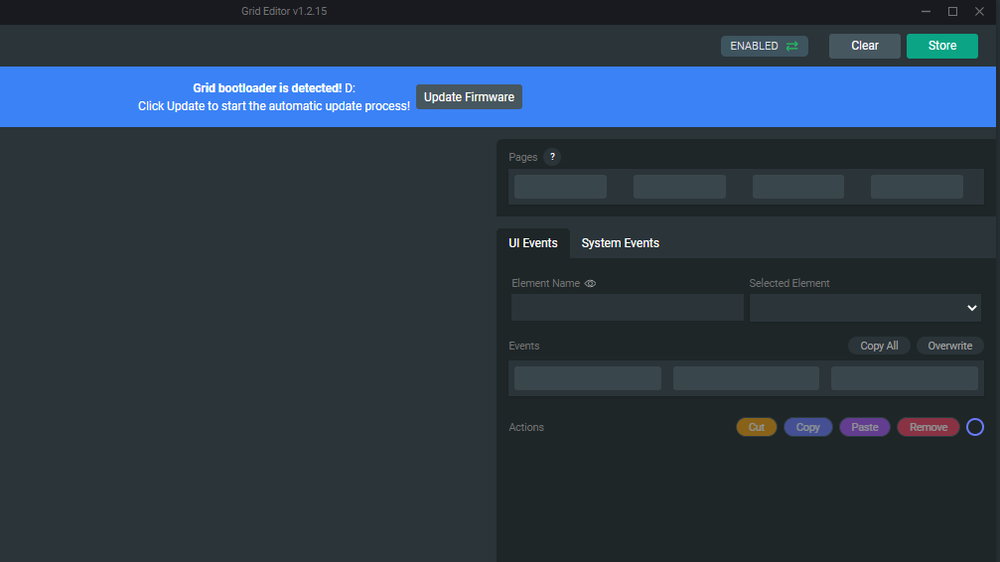

Grid Firmware is often updated. We introduce new features, stability improvements and bug fixes in each update. We highly recommend keeping your modules up-to-date, to ensure best performance and workflow compatibility. When you connect the modules while Grid Editor is running it will warn you if you are using an outdated firmware version.

> All your modules must have the same firmware version installed!

## Updating the firmware using Grid Editor

Whenever you're prompted with the 'Oops, firmware mismatch detected' message while running Grid Editor means you have a module plugged in with an outdated firmware version compared to Editor.

The mismatched module will be highlighted with red color, like this:

Gird Editor can update your module firmware automatically if you follow the on-screen messages at the top.

Reconnect the mismatched module (and that module only) while holding down the utility button on the side of the module.

After connecting you'll be prompted with a message in blue, asking whether you want to start the update. Press 'Update Firmware'.

Don't disconnect the module while the update is running or the update will fail.

When the update is complete, you will be prompted with a message in green color and the module will show up again in the Editor.

Congratulations! You've successfully updated the firmware of your module.

If you have multiple modules with firmware mismatches, you'll have to repeat this process one-by-one from the beginning.

## ⬇️ Updating the firmware manually

You can find the firmware versions hosted on GitHub. Click the button below to download the **latest** version.

[Grid Firmware Releases](https://github.com/intechstudio/grid-fw/releases)

## 💾 Install steps

Follow carefully the steps below, connect your Grid module directly to your compute at step 4.

1. Unzip the downloaded firmware file
2. You will find a file named grid_release.uf2, this is the firmware file
3. Update the modules one-by-one, only plugging in only one at a time
4. Hold down the utility side button while plugging in the USB cable
5. All the LEDs should turn from red to green color, indicating successful enumeration

6. You should see GRID removable device on your desktop
2. Drag and drop the firmware file onto the removable device or copy and paste it
3. Wait for the upload, the module should reboot and light up in default page color (blue)
4. Repeat this step for all your modules
