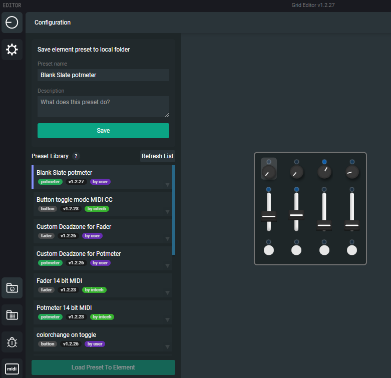

import cpya from './img/copy_action.png'
import psta from './img/pasted_actions.png'
import midiblch from './img/midi_block_change.png'
import midibl from './img/midi_block.png'
import peventact from './img/potmeter_event_actions.png'
import MIDIimp from './img/implement1.png'
import CEPreset from './img/celement_preset_new.png'

import ImageLightbox from '@site/src/general-layout-components/ImageLightbox';

This section will teach you how to create a Control Element configuration from a Control Element Preset in Grid Editor for use with MIDI hardware.

## What you'll need

For Grid to be able to control your hardware instrument you'll need **either one** of the following 3 things:

- **A computer with a MIDI interface** (some audio interfaces have this functionality).
- **The capability of the device to act as USB MIDI Host** (eg. devices: 1010music Blackbox, monome norns, Korg Drumlogue etc.)
- **A dedicated USB MIDI Host device**, like our very own [Knot](https://intech.studio/shop/knot).

**Computer.** With a computer you can use the Grid configuration of our [beginner's guide](./beginners), and in the DAW of your choice you can route the MIDI signal in the case of Ableton to a 'MIDI To' destination. Here you'd want to choose your interface and BAM, Grid should be transmitting data to your hardware if it's plugged into your MIDI interface with a MIDI cable.

**Host functionality.** With a host-capable instrument, you can just plug Grid directly into the host USB slot, usually a USB-A type slot. Then you can follow this Advanced guide for MIDI configuration in Grid Editor or the Beginner's guide [here](./beginners) if the device has MIDI learn available such as the 1010music Blackbox.

**USB MIDI Host.** With a dedicated USB MIDI Host device, the only things you'll need are cables. For Knot you'll probably need some 3.5 mm TRS to 5-pin DIN MIDI adaptors (type-A or B it doesn't matter) and the cable itself. You'll also need a phone charger or another type of power source like a power bank or a computer to power the device. If you have all these, you're ready.

Want to use Grid with hardware instruments, but lack all of the above?
Intech Studio Knot is for you! For more details visit the Intech Studio website [here](https://intech.studio/shop/knot).

### Setting up Knot with Grid

Using Knot as a USB MIDI Host for connecting Grid with you hardware MIDI devices is straightforward. You'll need the following things to get started:
- **1x Knot** and its respective USB-C cable for power or a DC power adapter
- **1x Grid module** of your choice (-or more of course!) and its respective USB-C cable for power and data
- **1x MIDI cable**, for connecting Knot with the MIDI hardware device (either a 3.5mm TRS cable or a 5-pin DIN MIDI cable with a TRS adapter)

To connect the devices together:
- Knot plugged into a power source either through the "USB-C" port or the "DC IN" port
- Grid plugged into Knot through the "USB HOST" port
- the MIDI hardware device plugged into the "MIDI OUT" of Knot with a MIDI cable

To check if everything's working aas it should, look out for the LEDs on Knot. When Knot first receive ample power they'll light up purple for a second. When a USB device is connected it should be green with the occasional blip when a message is sent or received.

## Importing a preset into Grid Editor (legacy)

<!---:::caution 
The control element preset sidebar is considered legacy feature from Grid Editor version 1.2.29 onward, and therefore no longer visible on the left sidebar!

Users wanting to utilize control element presets can still turn it back on under preferences!
:::
--->

From here on out, we'll use Grid Editor for our configuration needs. You can learn more about how to install and navigate Grid Editor here. If you haven't installed Grid Editor yet, please do so now before proceeding further.

[How to download Grid Editor.](/category/editor-how-to-install-editor)

We've prepared for you a couple of control element presets for starting out. These were made with the intention of being so called blank slates for a new configuration.

Here are the presets, choose and download the one that you can load on the Grid module you have at hand:

Download this preset:

- <a target="_blank" href="/presets/blank_slate_potmeter.json" download="blank_slate_potmeter.json"> Blank Slate potmeter (PO16, PFB4)</a>

- Blank Slate button (BU16, PBF4)

- Blank Slate fader (PBF4, EF44) *(pots and faders are different when it comes to presets)*

- Blank Slate encoder (EN16, EF44)

If Grid Editor is already installed on your computer, find the folder generated for presets under your documents by default or if you've customized this choice under Preferences, then in your folder of choice.

On Windows it should look something like this: `...\user\Documents\grid-userdata\presets\`. Move or paste your downloaded Blank Slate control element preset in this preset folder.

Now that you have a Blank Slate control element preset, first we'll have to get it onto the Grid module of your choice.

## Loading the preset on your Grid module (legacy)

In Grid Editor, look for the **control element preset button on the left**, to bring up the control element preset sidebar. There should be a list of presets, but the one you're looking for should be called something like this 'Blank Slate controlelement' depending on which control element you downloaded.

<!---

--->

<ImageLightbox imageSrc={CEPreset} citation={'The control element preset menu on the left sidebar'}/>

While your module is plugged in, choose the first control element (top-left), by either interacting with the control element physically or just simply clicking it in Editor.

:::tip A quick way to configure!
Interacting with the physical control elements on the module, then tweaking the configuration in software is a very fast way of working while configuring your modules, give it a try!
:::

When you have the control element selected, click the load preset to control element button on the bottom left of the control element preset sidebar. This replaces the default configuration on that control element with the blank slate one. Store that configuration on your module by clicking the green Store button on the top right.

## Understanding the basic configuartion steps

Here's what the control element does now (we're using the potentiometer one in this article as an example):

- When you turn it, it has **128 "steps" of internal values** under the internal `self:button_value()` function.
- It uses this function to define a [local variable](/docs/wiki/actions/variables/local-variables.md) **named `val`** on each potmeter turning event (see [potmeter event](/docs/wiki/events/ui-events/potmeter-event.md)) and this variable stores the values of the **128 "steps" in `val` from 0 to 127**.
- These 128 values can be used by the MIDI messages Grid can send out.
- In this Blank Slate control element preset the potentiometer is configured to send MIDI messages out on **MIDI channel 0** (called channel 0 in Editor, but it's the first channel in other applications like a DAW).
- And it sends these values as a **Control Change message (commonly a CC) named CC 32 and sets their value to `val`.**
- The [intensity](/docs/wiki/actions/led/intensity.md) of the corresponding LED is indicative of the potentiometer value, as its intensity uses the same `val` variable.
- So in essence you have a potmeter that reacts to your knob-turning efforts and **sends out the corresponding MIDI messages as a CC 32 message on MIDI channel 1 or 0**(depending on what software you're using).

Here comes the part where we'll change up the above described behavior to suit our needs.

## Understanding the MIDI implementation chart

In the case of a hardware instrument that can be controlled by MIDI, the manufacturer usually includes a description or a guide on how to send the correct messages for parameter control. This document is called a **MIDI implementation** document and is commonly found on the manufacturers website, in the instrument's owner's manual or in similar places.

In this guide we'll showcase how to set up your Grid module for controlling a Korg Volca FM instrument, for which Korg provides their MIDI implementation charts online in the form of a .PDF or a .TXT file.

To make this part of the guide easier to follow, we included a link to this document [here](./img/volcafm_MIDI_implementation_chart.pdf). When referencing it, we'll show screenshots to illustrate what we're doing, like this.

<ImageLightbox imageSrc={MIDIimp}/>

Alright so in your case, you'll have your own device with it's own implementation, but our goal will be the same: creating a Grid configuration that let's us control some of the instrument's parameters.

## Understanding MIDI messages and our goal

Let's understand what we have to send and where.

There is one thing we have to set first and foremost: **the MIDI channel**. Most devices only accept MIDI messages on one MIDI channel per voice at any given time. Information about changing the MIDI channel is found in the devices manual. In our case, the Volca FM has only one voice, so we set our MIDI channel to 1 on the Volca FM, which will correspond to channel 0 in Grid Editor. Progress:

`MIDI Channel 1`

Our specific goal here was to make a bass sound on the Korg Volca FM a bit more dynamic, so we wanted to create a control element that can change the whole sound into something different, but we'll take it one step at a time.

So let's start with something that's easily noticeable: the **envelope decay**. Here, on the [Volca FM MIDI implementation chart](#understanding-the-midi-implementation-chart) we'll look for Control Change messages and within those, we'll look for the one named **'Carrier Decay'**. Carrier Decay makes our sound amplitude changes slower or faster as the sound decays. In here, we can see that 'Carrier Decay' has a number associated with it in the column named 'Function'. That number will be **our CC number and we can see it's 45**. Cool, let's note this down.

`MIDI Channel 1, MIDI CC 45`

Alright so now we have our MIDI channel and our MIDI CC number figured out, how to continue?
Let's get into the Grid Editor once again.

## Customizing the MIDI Block in Editor

In Grid Editor we have our Blank Slate potentiometer created already. But now we want to tweak it further. [Earlier](#understanding-the-basic-configuartion-steps) we noted that the Blank Slate sent out a MIDI message on MIDI Channel 0 and it sent out a CC number 32 with the values of our potentiometer.
Only thing we'll have to change then, is the CC number then, easy.

<ImageLightbox imageSrc={peventact} citation={'Each potentiometer/fader has its own potmeter event'}/>

In Grid Editor choose the **potmeter event** on our Blank Slate potentiometer and we'll see 3 Blocks there:

- **A green one, named locals** dealing with variables like the one named `val`.
- **A red one named MIDI**, controlling the MIDI messages we're sending out.
- **A brown one named Intensity**, controlling the intensity of LED light of that Control Element.

**We'll only need to use the red one, named MIDI right now.** Opening up that [**MIDI Block**](/docs/wiki/actions/midi/midi.md) as it's called in Editor, we'll see a box with 4 cells we can enter values into. Our Blank Slate unmodified should look like this:

<ImageLightbox imageSrc={midibl} citation={'The MIDI message parameters exposed in the MIDI Action Block'}/>

This means the following: this potentiometer will send out a MIDI message on Channel 1, it will be a Control Change type of message, it will be specifically CC 32 and this message will change the value of whatever it's controlling to `val`, which as we earlier said contains the 'direction' or 'state' or our potentiometer as a value from 0 to 127.

A mouthful to be sure, but fortunately this time we only need to change what's in the third box, and change it from 32 to 45. After changing it, don't forget to Store the changes on the module by clicking the green button in the top right.

<ImageLightbox imageSrc={midiblch} citation={'Chainging the parameter1 here changes the CC# of the MIDI message'}/>

Now if we did everything right, our Blank Slate potentiometer should be controlling 'Carrier Decay' on the Volca FM when we turn it.

Now we have a Grid controlled synth in our hands and after tweaking it for a while, our bassline sounds much snappier!

---

## To go even further beyond

But why stop here? How about we try controlling multiple parameters on the Volca FM with just one potentiometer?

Alright, let's say we want to control three parameters, to truly shape the sound of our bassline. One will be 'Carrier Decay' which we already configured, the second will be 'Modulator Decay' which controls the timbre of the sound and the last one will be 'Algorithm' for some crazy noise.

Our MIDI Implementation chart tells us the numbers we need are 45 (we have this already), 43 for 'Modulator Decay' and 48 for 'Algorithm'.
Let's put this together in Grid Editor!

In Grid Editor, navigate to Blank Slate's potmeter event and click the blue circle at the end of our MIDI block to select it.

<ImageLightbox imageSrc={cpya} citation={'Copy and pasting actions is very helpful for getting things done quickly'}/>

Now we can copy and paste it two times, so we end up with three MIDI Blocks like this:

<ImageLightbox imageSrc={psta} citation={'Doubling up or tripling up on MIDI Blocks allows us to send out multiple MIDI messages by just moving one potentiometer'}/>

We have three identical messages now. So let's change them to the CC numbers we wanted: 45, 43 and 48, by typing them in the third box named parameter 1. Easy. Don't forget to store these changes on the Grid module with the Store button.

Now when we hear our bassline play on the Volca FM and turn our potentiometer, we should be hearing some very different bell-like sounds coming out from those speakers on the back. OR crazy noise. Who knows, FM synthesis is weird sometimes.

---

After completing at least the first part of this guide, you should be able to make your own configurations by creating your own control element presets and loading them on your modules, changing them wherever you like!

If you want more control, advanced functions like LFOs, conditional messages and more, check out our other articles on the wiki. Otherwise...

Have fun and see you around!
