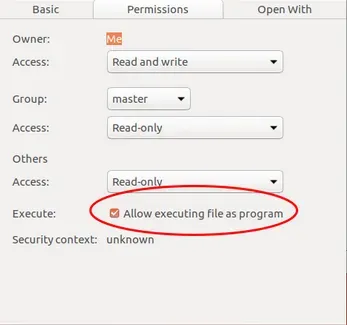
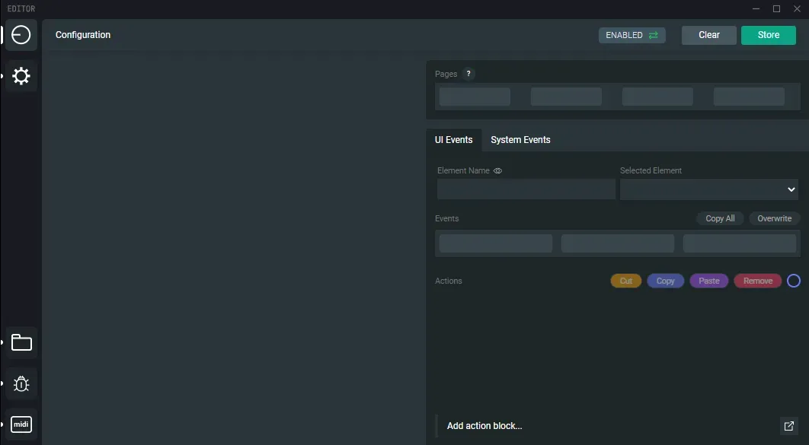

## Install requirements
- Internet access
- ~150MB disk space
- Ubuntu distribution

[Download Grid Editor Linux](https://intech.studio/grid-editor)

The executable files for Linux install are hosted on GitHub.

## Installation

The installer is a .AppImage file, right click on it and select **Properties**. 
Choose the **Permissons** tab and allow execution of the file as program.

The application will open up once it finished loading. A similar view should be on your desktop.

## Allow Serial Port

It can be that you did not used any similar serial USB device like Grid before. You must allow serial read / write for USB devices.

The easy way:

`sudoedit /etc/udev/rules.d/50-myusb.rules`

Save this text:

`KERNEL=="ttyUSB[0-9]*",MODE="0666"`

`KERNEL=="ttyACM[0-9]*",MODE="0666"`

Unplug the device and replug it, and it should be read/write from any user!

 