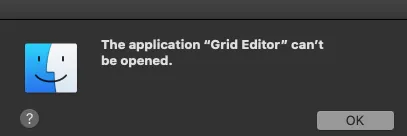

## Install requirements
- Internet access
- ~150MB disk space
- Mac OS version 10.13+ (High Sierra and up)

We have tested on Grid Editor on various Mac OS systems ourselves, and our user base comes currently with systems between 10.13 High Sierra and 11 (Big Sur).

[Download Grid Editor Linux](https://intech.studio/grid-editor)

The installer files for Mac OS are hosted on GitHub. Throughout the download process, your browser may prompt a warning. Choose to keep the file.

## Installation
By default, you can download the .dmg Disk Image installer. 

Mac OS may prompt an alert, depending on your Privacy Settings. In this case you must directly specify that you allow Grid Editor to be installed. 

[Follow this link for changing Security settings](https://support.apple.com/guide/mac-help/open-a-mac-app-from-an-unidentified-developer-mh40616/10.14/mac/10.14)

Once you are able to open the disk image, the installation takes few seconds.

The application will open up once finished. A similar view should be on your desktop.

