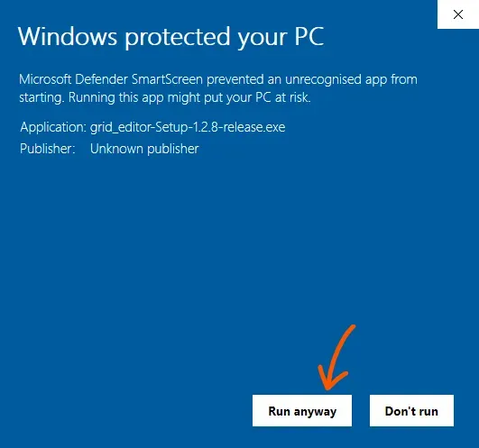
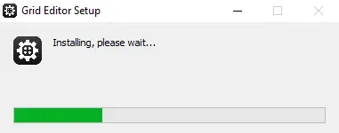

## Install requirements
- Internet access
- ~150MB disk space
- Windows 7 and up
```
<p>
<GithubDownloadButton type={'editor'} os={'windows'}>
  <div>Download Windows Installer</div>
</GithubDownloadButton>
</p>
```
The executable files for the Windows installer are hosted on GitHub. Throughout the download process, your browser may prompt a warning. Choose to keep the file.


## Installation
The installer is an executable file, double click on it to start the installation.


Windows may prompt an alert, depending on your Windows Defender security settings. In this case you must directly specify that you accept to run the installer. Click **more info**, then **run anyway** to finish install.




The installation takes few seconds.


The application will open up once finished. A similar view should be on your desktop.


## Install Location

To find the install location follow these steps:
- Open up the start menu (windows key) or hit win + R
- Type in to the searchbar: %appdata%
- Under the Roaming directory, locate grid_editor