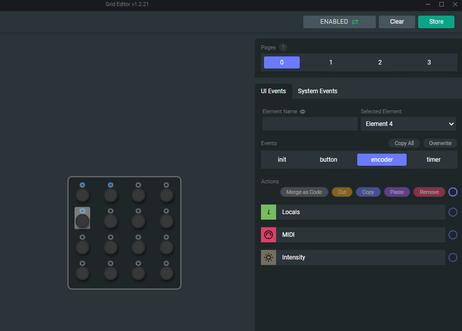

## Change relative encoding

By default encoders are set to absolute mode. In this mode, encoders act like potentiometers, with a MIDI value range 0-127.

With the help of **Encoder Mode** action, you can change the encoding to relative.

There are two modes implemented at the moment, which should cover all DAWs.

 - BinOffset
 - 2's Comp

Check both, and see which one works best with your DAW or software.

## Change encoder velocity

Encoders have a velocity variable built in, which can be changed with the Encoder Mode action.

By default the velocity value is 50. You can finetune this setting to work best with your own workflow and needs by using an Encoder Mode Block and changing this value.

You can turn off this behaviour completely by changing the encoder velocity to 0.

When using velocity with relative encoding modes or with higher encoder resolutions (for example encoder range with 0-2048 values), velocity values like 2-3-4 or 5 can be the sweet spot.

:::tip Good practice
It's useful to put Mode-type Blocks under the Init Event of the given Control Element. This way the Control Element will behave exactly as you'd want after booting up and this will also save you some characters on the Control Element Event itself for more important stuff.
:::