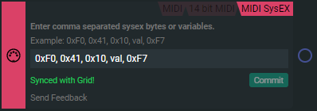

import ImageLightbox from '@site/src/general-layout-components/ImageLightbox';
import Tabs from '@theme/Tabs';
import TabItem from '@theme/TabItem';

---

<Tabs queryString="tab">
  <TabItem value="About SysEx" label="About SysEx" default>

System Exclusive MIDI message Block or SysEX Block for short, change your MIDI Blocks into SysEx mode, where you can both enter SysEx values based on an instrument's specifications or use variables calculated in the Action Chain.

In example `0xF0, 0x41, 0x10, val, 0xF7` val is a variable declared locally.

  </TabItem>
  <TabItem value="Reference Manual Entry" label="Reference Manual Entry">
  

### midi sysex send
- shortname: gmss
- **How:** `midi_sysex_send(...)`
  - Send 8bit SysEx data bytes (0-255) as separate arguments. eg: (0xF0, 0x41, 0x10, 0xF7)
- **What:** This function sends a MIDI sysex message when called.
- **Example:** 

</TabItem>
</Tabs>

